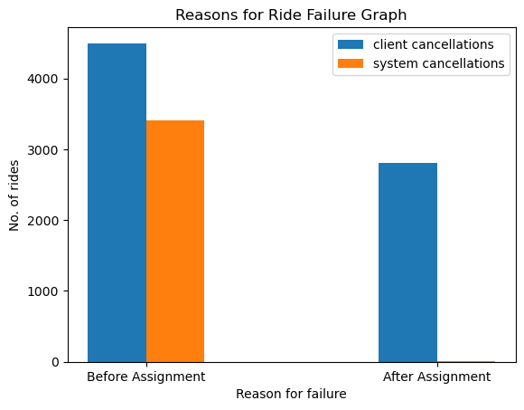

TASK 1
Build up distribution of orders according to reasons for failure: cancellations before and after driver assignment, and reasons for order rejection. Analyse the resulting plot. Which category has the highest number of orders?

                                                                

We can observe that the cancellations before driver assignment are greater than after driver assignment.
